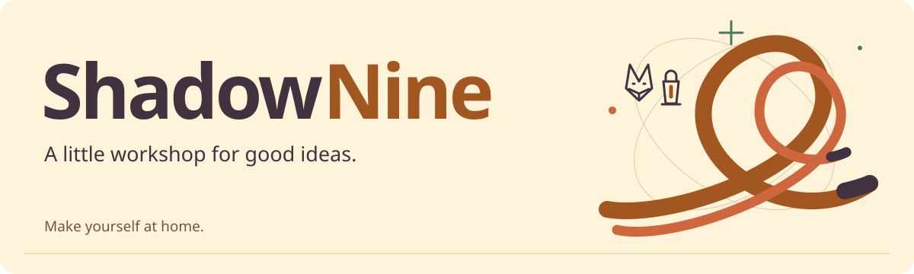
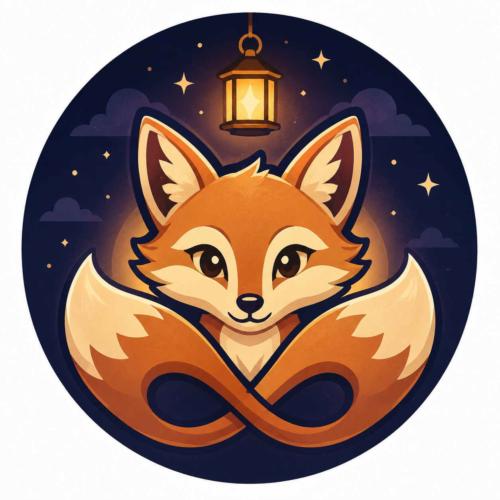

<picture>
  <source media="(prefers-color-scheme: dark) and (max-width: 600px)" srcset="assets/hello-dark-compact.svg" />
  <source media="(max-width: 600px)" srcset="assets/hello-light-compact.svg" />
  <source media="(prefers-color-scheme: dark)" srcset="assets/hello-dark.svg" />
  
</picture>

  <a href="https://shadownine.dev"><b>My little website</b></a> &nbsp; · &nbsp;
  <a href="#things-ive-brought-to-life">Explore my projects</a> &nbsp; · &nbsp;
  <a href="#a-little-soundtrack">Listen along</a>

# Hey, I'm ShadowNine.

I'm usually working on a few projects at once, turning big, strange ideas into real things. Cozy tools with a technical spine. Little experiments that grow legs. A few sparks that haven't found their shape yet.

**Tails fan. Inventive builder. Usually with music nearby.** 🖤 💛

I like my corners of the internet colorful, kind, and welcoming. Pull up a chair, have a look around, and make yourself at home. :]

 

## The ideas I'm growing

**Emon** is my long-term personal agent ecosystem. Private for now, and slowly taking shape.

**[ShadowNine Labs](https://github.com/ShadowNineLabs)** is the wider workshop I'm building around my creations, with room for the ideas that come next.

**[ShadowNine.dev](https://shadownine.dev)** is my personal corner of the web: projects, notes, music, and cozy experiments. [Peek at the source →](https://github.com/ShadowNineX/website)

Also on the horizon: Clawfox and Chat++. More little sparks to follow.

 

## Things I've brought to life

A few different corners of the same curious brain.

**[Cheat Engine × MCP](https://github.com/ShadowNineX/ce-mcp)**  
Bringing Cheat Engine workflows to AI tools through the Model Context Protocol.  
C# · .NET · also building the [plugin SDK](https://github.com/ShadowNineX/CESDK)

**[Little worlds for your desktop](https://github.com/ShadowNineX/wallpaper-engine)**  
TypeScript types, a Vite plugin, and runtime helpers for Wallpaper Engine web wallpapers.  
TypeScript · Vite · Wallpaper Engine

**[Music, meet my toolbox](https://github.com/ShadowNineX/openclaw-spotify)**  
Spotify search, playlists, and playback controls for OpenClaw.  
TypeScript · Spotify · OpenClaw

**[A web server. Inside Portal 2.](https://github.com/ShadowNineX/p2ce-hono-web-server)**  
A Hono-style web server experiment in AngelScript for Portal 2: Community Edition.  
AngelScript · Portal 2: Community Edition · a slightly unusual place for a web server

[**Wander through all my projects →**](https://github.com/ShadowNineX?tab=repositories)

## On the workbench

The projects with the most recent pushes. There's usually more than one thing in pieces.

<!-- WORKBENCH:START -->

**[skill-gardener](https://github.com/ShadowNineX/skill-gardener)**  
Last push: 2026-09-06 · Python

**[MCP-UAsset-Toolkit](https://github.com/ShadowNineX/MCP-UAsset-Toolkit)**  
Last push: 2026-09-05 · C\#

Automate UE reverse engineering using UAsset API and CUE4Parse

**[website](https://github.com/ShadowNineX/website)**  
Last push: 2026-09-04 · Astro

A quiet Astro site for ShadowNine's projects, notes, and cozy web experiments.

From my public repositories · refreshed daily · ordered by last push

<!-- WORKBENCH:END -->

<b>Open the toolbox</b> — languages, frameworks, and the things I build with

 

A colorful toolbox for when an idea starts taking shape.

**🧡 Languages** 
         

**🌿 Frameworks & Libraries** 
      

**🪄 Tools & Runtimes** 
  

## A little soundtrack

There's usually music nearby while I'm building.

[Spotify](https://open.spotify.com/user/31wl2m3aqxcky555yhqi7epzau7u) · [Last.fm](https://www.last.fm/user/ShadowNineX) · [My Spotify client](https://github.com/ShadowNineX/foxify) · [My Last.fm client](https://github.com/ShadowNineX/scrobbletail)

## Little steps, long trails

Small steps add up. Here's the trail they've left behind.

<picture>
  <source media="(prefers-color-scheme: dark)" srcset="https://raw.githubusercontent.com/ShadowNineX/ShadowNineX/refs/heads/output/github-contribution-grid-snake-dark.svg" />
  
</picture>

[Explore the rest of my contribution garden →](https://github.com/ShadowNineX?tab=overview)

<b>Do not open the lemon drawer.</b> 🍋

### Combustible wisdom

> *When life gives you lemons, don’t make lemonade. Make life take the lemons back! Get mad! I don’t want your damn lemons, what the hell am I supposed to do with these? Demand to see life’s manager! Make life rue the day it thought it could give Tails! Do you know who I am? I’m the man who’s gonna burn your house down! With the lemons! I’m gonna get my engineers to invent a combustible lemon that burns your house down!*

---

*“The best way to predict the future is to build it yourself.”*  
— ShadowNine

**Thanks for wandering through — I'm glad you stopped by.**  
Take care, and build something that feels like you. :]

[**The workshop continues at ShadowNine.dev →**](https://shadownine.dev)

