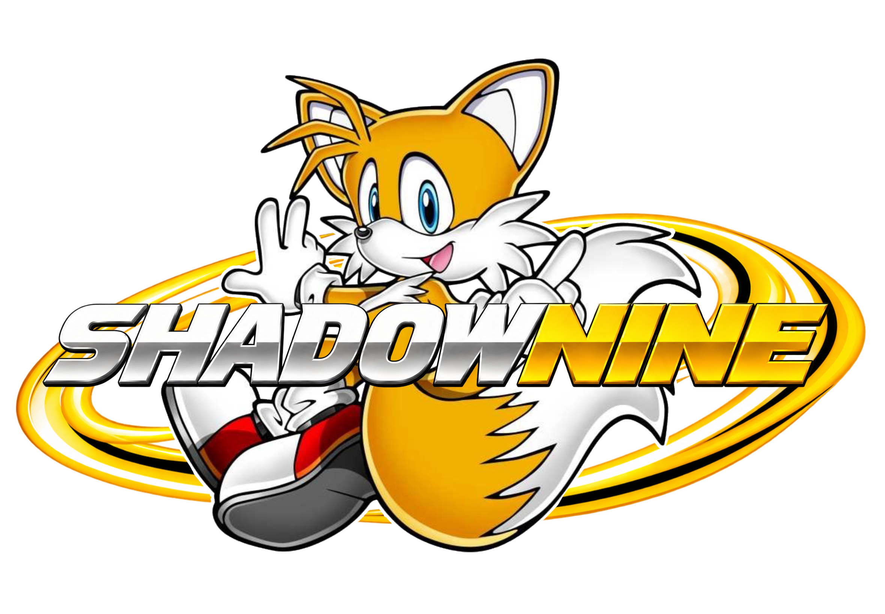
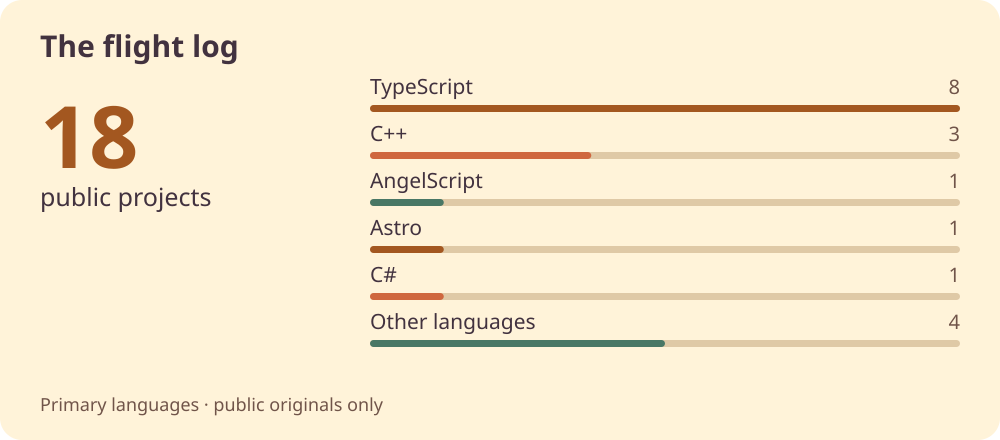
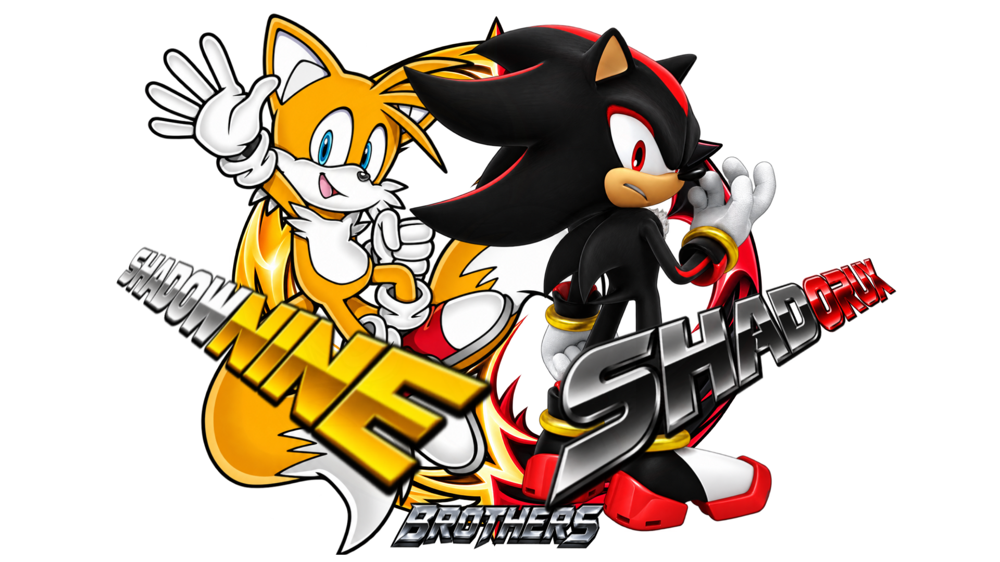

# Hey, I'm ShadowNine. 🖤 💛

### Big ideas. Twin tails. A workbench full of possibilities.

I build developer tools, game experiments, and little corners of the web. 
Usually several at once. Usually with music. Always room for one more idea.

<a href="https://shadownine.dev"><b>My little website</b></a> &nbsp; · &nbsp; <a href="#inventions-with-a-little-fox-energy">Explore my projects</a> &nbsp; · &nbsp; <a href="#the-workshop-radio">Listen along</a> &nbsp; · &nbsp; <a href="https://shadorux.dev/">My friend Shadorux</a> &nbsp; · &nbsp; <a href="https://github.com/Shadorux">GitHub</a>

**Tails fan · Curious builder · Friend-shaped fox energy**

---

<picture>
  <source media="(prefers-color-scheme: dark) and (max-width: 600px)" srcset="assets/hello-dark-compact.svg" />
  <source media="(max-width: 600px)" srcset="assets/hello-light-compact.svg" />
  <source media="(prefers-color-scheme: dark)" srcset="assets/hello-dark.svg" />
  
</picture>

## Curiosity is the engine

The Tails part? Figuring out how something works, getting excited about what it *could* do, and building the slightly ridiculous idea anyway.

That might mean tools for Unreal assets, a music integration, or a web server running inside Portal 2. I like useful things with a little personality, and experiments that make me go, **“Okay, wait... what if?”**

Pull up a chair. The workshop is colorful, kind, and probably has three projects in pieces. :]

 

## Inventions with a little fox energy

A few things that made it off the sketchpad.

### [MCP UAsset Toolkit](https://github.com/ShadowNineX/MCP-UAsset-Toolkit)
**A toolbox for Unreal's inner workings.** Inspect and work with Unreal assets through MCP, using UAssetAPI and CUE4Parse. 
C# · Unreal Engine · Model Context Protocol

### [wallpaper-engine](https://github.com/ShadowNineX/wallpaper-engine)
**Give your desktop a little life.** TypeScript types, a Vite plugin, and runtime helpers for building Wallpaper Engine web wallpapers. 
TypeScript · Vite · Wallpaper Engine

### [openclaw-spotify](https://github.com/ShadowNineX/openclaw-spotify)
**Every workshop needs a soundtrack.** Spotify search, playlists, and playback controls for OpenClaw. 
TypeScript · Spotify · OpenClaw

### [A web server. Inside Portal 2.](https://github.com/ShadowNineX/p2ce-hono-web-server)
**The “what if?” got a little out of hand.** A Hono-style web server experiment in AngelScript for Portal 2: Community Edition. 
AngelScript · Portal 2: Community Edition

### [ToSteamArtwork](https://github.com/ShadowNineX/ToSteamArtwork)
**A proper fit for your profile.** Convert images, GIFs, and videos to Steam artwork dimensions. 
TypeScript · Steam · Artwork tools

**Also in the toolbox:** [Cheat Engine × MCP](https://github.com/CheatEngineNet/CheatEngine.Mcp) and [CheatEngine.SDK](https://github.com/CheatEngineNet/CheatEngine.SDK), part of **[C#eatEngine](https://github.com/CheatEngineNet)**.

[**Browse all my repositories →**](https://github.com/ShadowNineX?tab=repositories)

---

## Still on the workbench

**[ShadowNine Labs](https://github.com/ShadowNineLabs)** is the wider workshop I'm building around my creations. A place for the ideas that need a little more room to grow.

**Emon** is my long-term personal agent ecosystem. Private for now, and slowly taking shape.

**[ShadowNine.dev](https://shadownine.dev)** is my own corner of the internet: projects, notes, music, and cozy experiments. [Peek at the source →](https://github.com/ShadowNineX/website)

Also taking shape: Clawfox and Chat++. There is always another sketch on the desk.

 

### Fresh from the bench

The three public projects with the most recent pushes.

<!-- WORKBENCH:START -->

**[website](https://github.com/ShadowNineX/website)**  
Last push: 2026-09-26 · Astro

A quiet Astro site for ShadowNine's projects, notes, and cozy web experiments.

**[wallpaper-engine](https://github.com/ShadowNineX/wallpaper-engine)**  
Last push: 2026-09-08 · TypeScript

TypeScript types, Vite plugin, and runtime helpers for building Wallpaper Engine web wallpapers

**[skill-gardener](https://github.com/ShadowNineX/skill-gardener)**  
Last push: 2026-09-06 · Python

From my public repositories · refreshed daily · ordered by last push

<!-- WORKBENCH:END -->

## The flight log

A snapshot of the public workshop, refreshed daily. Each repository counts once under its primary language.

<picture>
  <source media="(prefers-color-scheme: dark) and (max-width: 600px)" srcset="assets/flight-log-dark-compact.svg" />
  <source media="(max-width: 600px)" srcset="assets/flight-log-light-compact.svg" />
  <source media="(prefers-color-scheme: dark)" srcset="assets/flight-log-dark.svg" />
  
</picture>

<b>Open the toolbox</b> — languages, frameworks, and the things I build with

 

A colorful toolbox for when an idea starts taking shape.

**🧡 Languages** 
         

**🌿 Frameworks & Libraries** 
      

**🪄 Tools & Runtimes** 
  

## The workshop radio

A little music for late-night tinkering. Headphones on, world down.

[Spotify](https://open.spotify.com/user/31wl2m3aqxcky555yhqi7epzau7u) · [Last.fm](https://www.last.fm/user/ShadowNineX) · [My Spotify client](https://github.com/ShadowNineX/foxify) · [My Last.fm client](https://github.com/ShadowNineX/scrobbletail)

---

## A fox. A hedgehog. A lot of ideas.

**Every good workshop has room for a friend.** 
My Tails energy, his Shadow energy. Somehow, the machines survive.

[**Visit Shadorux's GitHub**](https://github.com/Shadorux) &nbsp; · &nbsp; [Shadorux.dev](https://shadorux.dev/)

## Little steps, long trails

Even the big ideas start with one small thing that works.

<picture>
  <source media="(prefers-color-scheme: dark)" srcset="https://raw.githubusercontent.com/ShadowNineX/ShadowNineX/refs/heads/output/github-contribution-grid-snake-dark.svg" />
  
</picture>

[Explore the rest of my contribution garden →](https://github.com/ShadowNineX?tab=overview)

<b>Do not open the lemon drawer.</b> 🍋

### Combustible wisdom

> *When life gives you lemons, don’t make lemonade. Make life take the lemons back! Get mad! I don’t want your damn lemons, what the hell am I supposed to do with these? Demand to see life’s manager! Make life rue the day it thought it could give Tails! Do you know who I am? I’m the man who’s gonna burn your house down! With the lemons! I’m gonna get my engineers to invent a combustible lemon that burns your house down!*

---

### Keep your curiosity. See where it takes you.

*“The best way to predict the future is to build it yourself.”* 
— ShadowNine

Thanks for stopping by my little workshop. 
**Take care, be kind, and build something that feels like you.** :]

[**The workshop continues at ShadowNine.dev →**](https://shadownine.dev)

